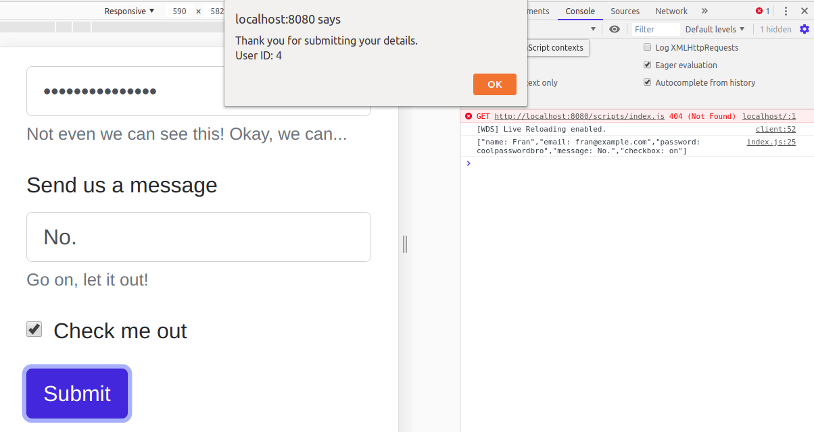

# Submit me 

**Instructions**: 

* Look at the form on HTML. In the `index.js` file, create a post request on submit. 

**Requirements**: 
* Use fetch to post data. 
* Use `async await` syntax.
* When resolving your promise, print the raw JSON to the console. 
* Alert the user once they have submitted the form.

* You can use [JSONPlaceholder](https://jsonplaceholder.typicode.com/) to make a POST request. 

